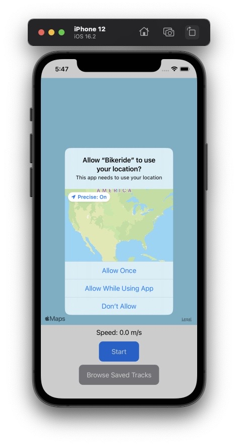

# Overview

This is an empty public repository to show a school project that was implemented by me. 
Built using the SwiftUI and Mapkit frameworks. With a push of a button, the app tracks the user's current location and continuously records their route using map annotations. 
Uses Apple’s FileManager API to save recorded tracks to the user’s local storage efficiently. 

Images of the completed version can be seen below.

Due to academic integrity rules, the code will remain hidden in a private repository.

# Images

## Requesting location permissions

## Map view

## Saved paths list

## Path view

## Saving current path

